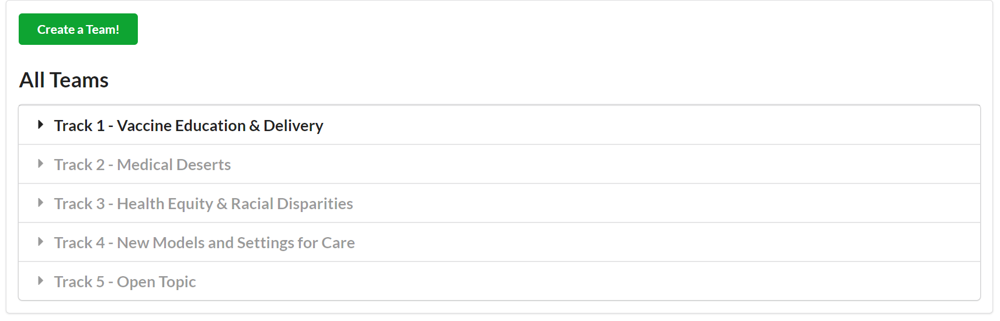
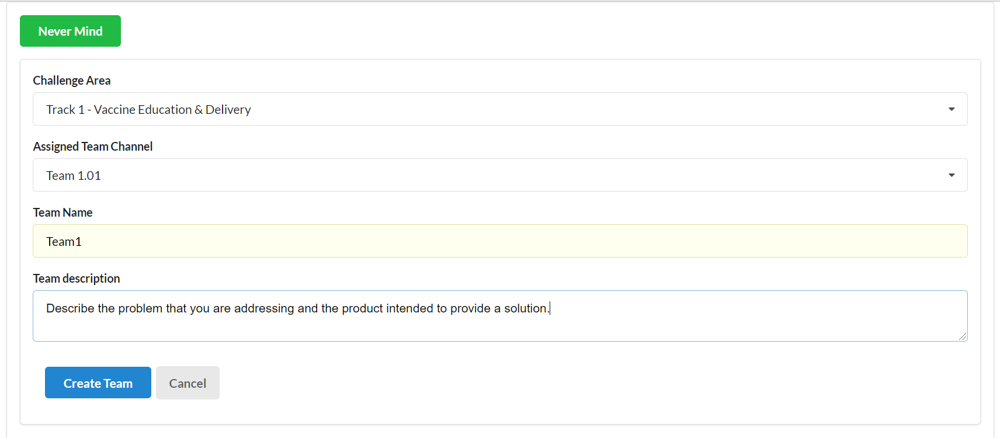
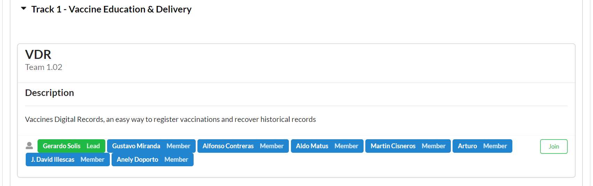
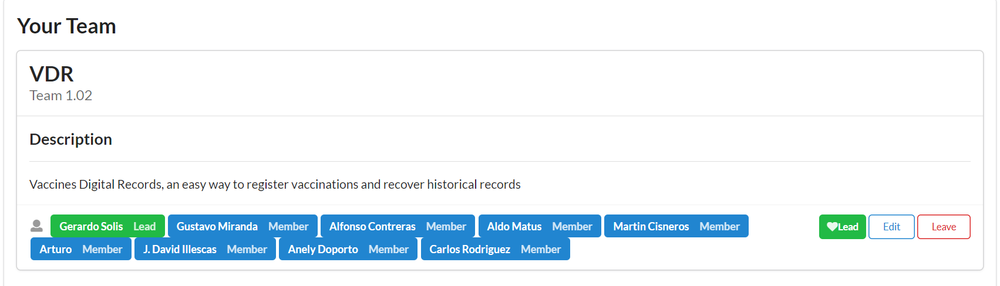
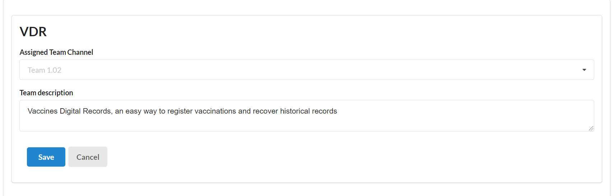

# Introduction 
TODO: Give a short introduction of your project. Let this section explain the objectives or the motivation behind this project. 

# Getting Started
TODO: Guide users through getting your code up and running on their own system. In this section you can talk about:
1.	Installation process
2.	Software dependencies
3.	Latest releases
4.	API references

# Build and Test
**Why?**
The purpose of this application is to facilitate collaboration during the hackathon. In order to do so, the functionalities include creating and joining teams.

This application is intended to facilitate collaboration and maintain structure during the hackathon by creating teams. To begin, click “Create a Team!”.

Next, fill out the information about your team. This includes the “Challenge Area,” “Assigned Team Channel,” “Team Name,” and “Team description.” Once finished, click “Create Team”.

You can create a team, and you can also join a team under “All Teams.” Below is an example of a team. In addition to the team’s name, channel, and description, there is a list with the team members and a button, “Join.” Click “Join” to become a member. 

You can now see this team you joined under “Your Team.” You also have options to “Lead”, “Edit”, and “Leave.” By clicking on “Lead”, you will be assigned the role of leader for the group. By clicking on “Leave,” you will leave the group and it will be removed from “Your Team.”

By clicking on “Edit,” you can change the “Assigned Team Channel” and “Team description.”

 

# Ideas for Spring
* Maybe sort teams by least number of participants
* Add flag to indicate team is "full"
* Team create: check off what skills you're bringing to the team
* Team create:Team Description gets changed to problem pitch (keep away from solution and focus on problem)
* Team create: update problem types
* Team channel names maynot be autocreated
* Admin can associate a team to a channel
* Admin page / authorization 
* capture usage meterics for teams and users
* questions we want answers to: "how many searches are done?" "When were teams created?"" etc...

If you want to learn more about creating good readme files then refer the following [guidelines](https://docs.microsoft.com/en-us/azure/devops/repos/git/create-a-readme?view=azure-devops). You can also seek inspiration from the below readme files:
- [ASP.NET Core](https://github.com/aspnet/Home)
- [Visual Studio Code](https://github.com/Microsoft/vscode)
- [Chakra Core](https://github.com/Microsoft/ChakraCore)
